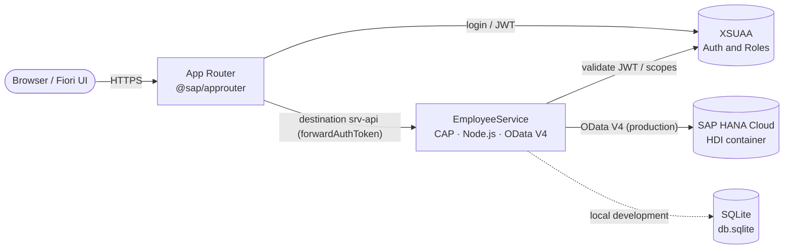

# Enterprise Employee Management & Approval System

> A production-grade **SAP Cloud Application Programming Model (CAP)** service implementing a Leave / Expense / Travel request workflow — with a draft-enabled **SAP Fiori Elements** UI, role-based approvals, and a complete **SAP BTP Cloud Foundry** deployment blueprint.

-0FAAFF)


---

## 1. Project Overview

The Employee Management & Approval System is a backend-plus-UI application that models a typical enterprise approval process. Employees raise **Requests** (leave, expense, or travel); **Managers** review them and either **approve** or **decline**. Every decision is captured as an **Approval** record, and finalized requests are locked against further edits.

The project is a reference implementation of an end-to-end SAP CAP stack: a normalized domain model, an OData V4 service enriched with custom business logic and role-based authorization, a Fiori Elements UI driven entirely by annotations, and the deployment descriptors (MTA, HANA, XSUAA, App Router) required to run on SAP BTP Cloud Foundry.

## 2. Architecture & Tech Stack

The application follows the standard SAP BTP multi-target application (MTA) topology: an **App Router** terminates the user session and handles XSUAA authentication, then forwards authenticated requests to the **CAP service**, which persists to an **HDI-managed SAP HANA Cloud** container in production (and SQLite locally).



| Layer | Technology |
| :--- | :--- |
| **Framework** | SAP CAP (`@sap/cds` 8), Node.js |
| **API protocol** | OData V4 |
| **UI** | SAP Fiori Elements — List Report & Object Page, fully annotation-driven, draft-enabled |
| **Persistence (local)** | SQLite via `@cap-js/sqlite` |
| **Persistence (production)** | SAP HANA Cloud, HDI container via `@cap-js/hana` |
| **Authentication** | XSUAA (`@sap/xssec`) in production · `mocked` auth for local development |
| **Routing / UI serving** | SAP Application Router (`@sap/approuter`) |
| **Packaging & deployment** | Cloud Foundry Multi-Target Application (`mta.yaml`) |
| **Runtime** | Node.js ≥ 20 (developed and tested on Node 24) |

## 3. Key Features

### 🗂️ Draft Choreography
The `Request` entity is annotated with `@odata.draft.enabled`, activating OData V4 draft handling. CAP generates the draft shadow tables (`..._drafts`, `DRAFT_DraftAdministrativeData`) and the `draftPrepare` / `draftActivate` actions. This powers the **Create** and **Edit** flows in Fiori Elements: users work against an isolated draft and explicitly **Save** (activate) or **Discard**, with no partial writes to active data.

### ⚙️ Custom Business Logic
Implemented as CAP event handlers in [`srv/service.js`](srv/service.js):

- **`before CREATE`** — rejects a `StartDate` in the past; enforces `Amount > 0` for `Expense` requests; forces `Status` to `Pending` regardless of client input.
- **`before UPDATE`** — reads the persisted status and **locks** any request already `Approved` or `Rejected` (returns HTTP 409), guaranteeing decision immutability.
- **State transitions** — the bound actions `approve()` and `decline()` transition a request to `Approved` / `Rejected`.

All validation surfaces through the standard `req.error()` API with precise HTTP codes and field targets.

### 🎨 Criticality UI Color-Coding
A transient `virtual Criticality` field is computed in an `after READ` handler and bound to the `Status` column via `@UI.Criticality`. Fiori Elements renders the status as a semantic colored object status:

| Status | Criticality | Color |
| :--- | :---: | :--- |
| Approved | 3 | 🟢 Green (Positive) |
| Pending | 2 | 🟠 Orange (Critical) |
| Rejected | 1 | 🔴 Red (Negative) |

### 🔐 Role-Based Access Control (Manager vs. Employee)
- The entire `EmployeeService` requires `@requires: 'authenticated-user'` — anonymous requests receive **401**.
- The `approve` and `decline` actions require `@requires: 'Manager'` — an authenticated non-manager receives **403**.

The `Manager` scope, role template, and role collection are declared in [`xs-security.json`](xs-security.json) for XSUAA, and mirrored by mock users locally.

## 4. Local Development Guide

### Prerequisites
- **Node.js ≥ 20** (tested on Node 24) and npm
- No global `@sap/cds-dk` required — the CLI is included as a project `devDependency` and invoked via `npx`.

### Setup & Run

```bash
# 1. Install dependencies
npm install

# 2. Create and seed the local SQLite database
#    (db.sqlite is git-ignored, so this bootstraps schema, sample data and draft tables)
npx cds deploy

# 3. Start the service (local cds-serve — no global CLI needed)
npm start
```

The service starts on **http://localhost:4004**. Useful entry points:

| Resource | URL |
| :--- | :--- |
| Service index | `http://localhost:4004` |
| Fiori Elements preview | `http://localhost:4004/$fiori-preview/EmployeeService/Requests#preview-app` |
| OData entity set | `http://localhost:4004/employee/Requests` |
| Service metadata | `http://localhost:4004/employee/$metadata` |

### Logging In (mocked users)

Because the service requires an authenticated user, the browser prompts for **Basic authentication**. Two mock users are pre-configured for local development (see the `cds.requires.auth` block in [`package.json`](package.json)):

| User | Password | Role | Can approve / decline? |
| :--- | :--- | :--- | :---: |
| `alice` | `alice` | *(none — standard Employee)* | ❌ 403 Forbidden |
| `bob` | `bob` | `Manager` | ✅ |

Log in as **`bob`** to exercise the full manager workflow (Create → Approve / Decline); log in as **`alice`** to observe read access with enforced authorization on the actions.

Example with `curl`:

```bash
# Read as alice (employee) — allowed
curl -u alice:alice http://localhost:4004/employee/Requests

# Approve as bob (manager) — allowed
curl -u bob:bob -X POST \
  "http://localhost:4004/employee/Requests(RequestID=<id>,IsActiveEntity=true)/EmployeeService.approve"
```

> **Local vs. production** — both auth and persistence are profile-scoped: `mocked` basic auth + SQLite for local development, and `xsuaa` (JWT) + SAP HANA Cloud under the `[production]` profile. Switching targets requires no code changes — only the active CAP profile.

---

## Data Model

```
Employee 1───* Request 1───* Approval
                  │
                  └── Type ⇒ RequestTypes (fixed-value help: Leave / Expense / Travel)
```

Defined in [`db/schema.cds`](db/schema.cds); service projections and actions in [`srv/service.cds`](srv/service.cds); UI annotations in [`app/annotations.cds`](app/annotations.cds); seed data in [`db/data/`](db/data).

## Project Structure

```
employee-portal/
├── db/
│   ├── schema.cds                 # Domain model: Employee, Request, Approval, RequestTypes
│   └── data/                      # CSV seed data
├── srv/
│   ├── service.cds                # EmployeeService: projections, bound actions, authorization
│   └── service.js                 # Custom handlers: validation, state locks, criticality, actions
├── app/
│   ├── annotations.cds            # Fiori Elements UI: LineItem, Object Page, Criticality, ValueHelp
│   ├── index.cds                  # Links UI annotations to the service model
│   └── router/                    # SAP App Router configuration (xs-app.json)
├── xs-security.json               # XSUAA scopes, role template & role collection
├── mta.yaml                       # Cloud Foundry deployment descriptor
└── package.json                   # Dependencies & profiles (local SQLite / prod HANA + XSUAA)
```

## Deployment to SAP BTP (Cloud Foundry)

The [`mta.yaml`](mta.yaml) blueprint provisions four artifacts: the **CAP service** (`nodejs`), the **HANA HDI deployer** (`hdb`), the **App Router** (`approuter.nodejs`), and the bound **HANA** and **XSUAA** service instances.

```bash
# Build the multi-target archive
npx mbt build

# Deploy to a Cloud Foundry space (requires HANA Cloud & XSUAA entitlements)
cf deploy mta_archives/employee-portal_1.0.0.mtar
```

## License

UNLICENSED — provided as a reference implementation.
